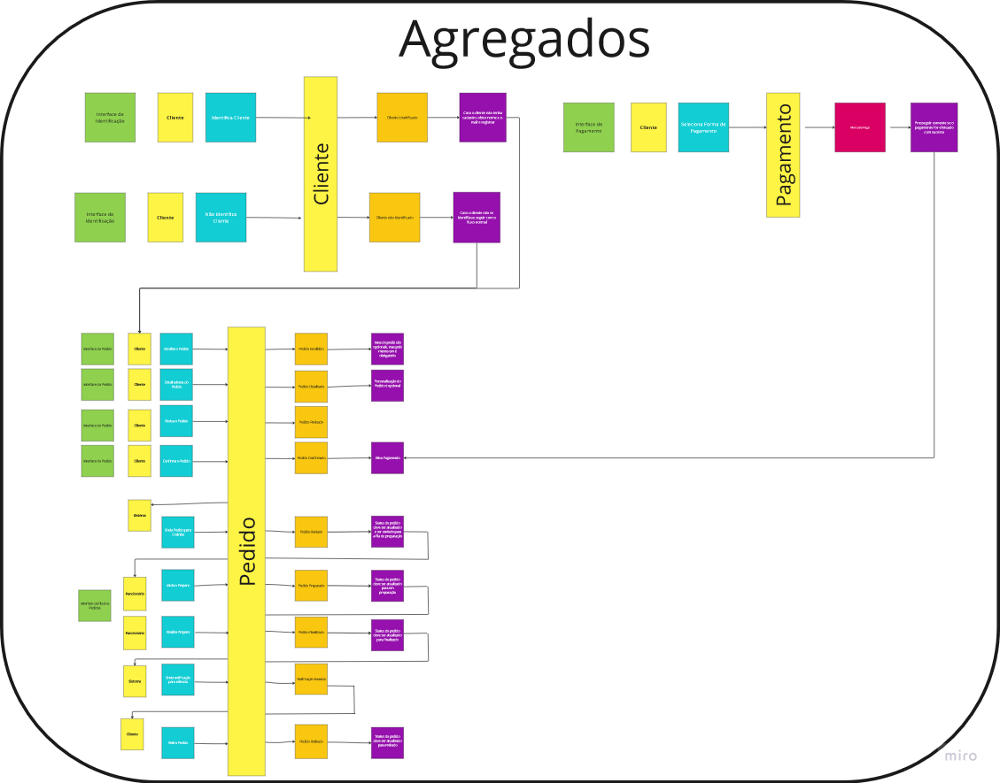
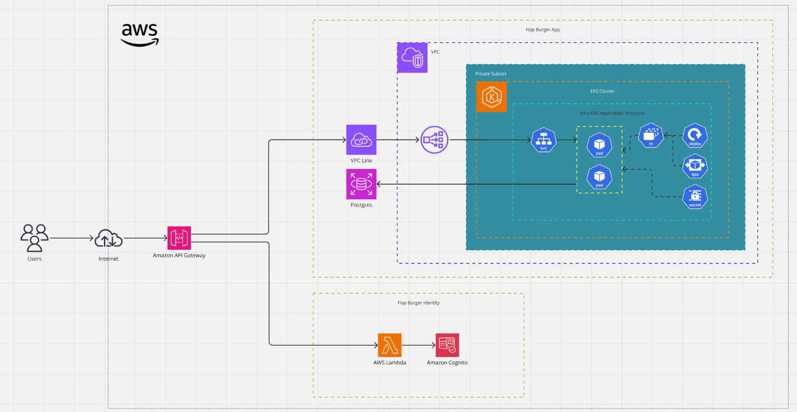
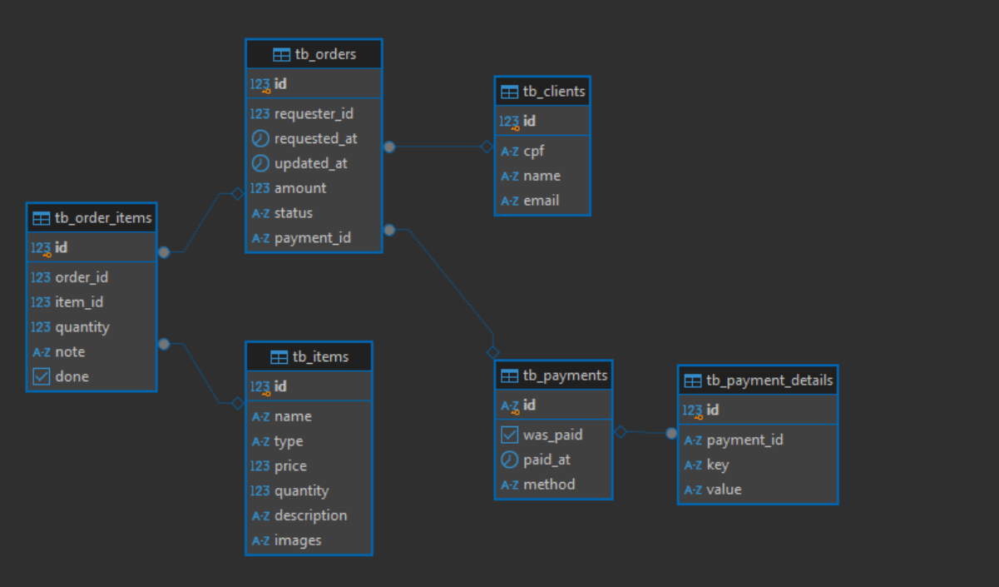

# Tech Challenge FIAP Project - Fase 4

Este projeto foi desenvolvido durante a `Fase IV`, do curso de `Arquitetura de Software` da FIAP, como requisito para avaliação.

## Integrantes do Grupo 7SOAT-31:

- Julio Augusto Silva (RM355432)
- Lucas Henrique de Oliveira Silva (RM354904)
- Getúlio Magela Silva (RM355427)
- Lucas Rego Lima (RM356101)
- Lilian Rosario de Jesus (RM355928)

## Demonstração em Vídeo

### Fase 1

- [Assistir no YouTube](https://www.youtube.com/watch?v=I0tNdblTFDc)

### Fase 2

- [Assistir a Parte 1 da Fase 2 no YouTube](https://www.youtube.com/watch?v=r81e0Y-HJx4)
- [Assistir a Parte 2 da Fase 2 no YouTube](https://www.youtube.com/watch?v=cL7ryiqxlvk)

### Fase 3

- [Assistir a Parte 1 no YouTube](https://youtu.be/rsVHmP_bMac)
- [Assistir a Parte 2 no YouTube](https://youtu.be/ouYiMiizpLE)

### Fase 4

- [Assistir no YouTube](TODO)

## Event Storming :[Ver no Miro 👁️](https://miro.com/app/board/o9J_lHsdpmE=/?moveToWidget=3458764608376800764&cot=10):

## Event Storming - Aggregates :[Ver no Miro 👁️](https://miro.com/app/board/o9J_lHsdpmE=/?moveToWidget=3458764608480612936&cot=10):

## Arquitetura Cloud (AWS) :[Ver no Miro 👁️](https://miro.com/app/board/o9J_lHsdpmE=/?moveToWidget=3458764608376800696&cot=14)

## Banco de Dados:

### Preparation Service

Foi escolhido o Postgres na AWS com RDS por ser um banco bastante flexível e com bom custo benefício. A estrutura de dados do serviço é bastante simples atualmente, contudo, para a evolução do serviço o Postgres não será um problema.

### Payments e Orders Services

Foi aplicado MongoDB implantado em infraestrutura da AWS gerenciada pelo Atlas. O banco forerece grande flexibilidade no trabalho e evolução dos dados.

## Modelagem da Base: [Ver no Miro 👁️](https://miro.com/app/board/o9J_lHsdpmE=/?moveToWidget=3458764608480748590&cot=10)

## Repositórios

A solução está disposta em 10 repositórios conforme as descrições abaixo:

- Repositório central para organizar a documentação da solução: [Ver Repositório](https://github.com/FIAP-7SOAT-TCG31/.github)

- Repositório central para provisionar e gerenciar o APIGateway que expõe tanto a Lambda de autenticação quanto o acesso à nossa aplicação no EKS com terraform: [Ver Repositório](https://github.com/FIAP-7SOAT-TCG31/fiap-7soat-tcg31-gateway)

- Repositório para provisionar a infraestrutura de banco de dados RDS com terraform: [Ver Repositório](https://github.com/FIAP-7SOAT-TCG31/fiap-7soat-tcg31-database)

- Repositório para provisionar a infraestrutura de banco de dados MongoDB no Atlas com terraform: [Ver Repositório](https://github.com/FIAP-7SOAT-TCG31/fiap-7soat-tcg31-mongodb)

- Repositório para provisionar a infraestrutura de RabbitMQ no cluster kubernetes: [Ver Repositório](https://github.com/FIAP-7SOAT-TCG31/fiap-7soat-tcg31-rabbitmq)

- Repositório para provisionar a infraestrutura do EKS com terraform: [Ver Repositório](https://github.com/FIAP-7SOAT-TCG31/fiap-7soat-tcg31-kubernetes)

- Repositório para o serviço de autenticação serverless escrito com Typescript e implantado como um Lambda: [Ver Repositório](https://github.com/FIAP-7SOAT-TCG31/fiap-7soat-tcg31-lambda)

- Repositório para o serviço de Ordens (OrderService) escrito com NestJS e Node e implantado na infraestrutura do EKS: [Ver Repositório](https://github.com/FIAP-7SOAT-TCG31/fiap-7soat-tcg31-orders)

- Repositório para o serviço de Pagamentos (PaymentsService) escrito com NestJS e Node e implantado na infraestrutura do EKS: [Ver Repositório](https://github.com/FIAP-7SOAT-TCG31/fiap-7soat-tcg31-payments)

- Repositório para o serviço de Preparo (PreparationService) escrito com NestJS e Node e implantado na infraestrutura do EKS: [Ver Repositório](https://github.com/FIAP-7SOAT-TCG31/fiap-7soat-tcg31-preparation)

## CICD

- Todos os repositórios estão com esteiras automatizadas para implantação.
- Todos os repositórios possuem proteções na branch principal (main), requisitando Pull Request com duas aprovações e que todos os checks de pipe tenham passado antes de realizar o merge.

## OpenAPI - Swagger

- Cada serviço possui seu próprio swagger disponível na rota `/docs` com o serviço em execução.

## Requisitos Funcionais:

- Cadastro de Clientes - Identity
- Cadastro de Itens - Somente ADMINs
- Gestão de Pedidos
  - Inclusão/Remoção de Itens
  - Confirmação (Checkout)
  - Confirmação de Pagamento (Webhook)
  - Followup

## Requisitos Não Funcionais:

- Utilizar recurso serverless para identidade - Lambda
- Utilizar IDP para dados de identidade - Cognito
- Ambiente em núvem (Cloud AWS)
- Banco de dados em núvem (RDS - Postgres)
- App principal rodando em cluster Kubernetes em nuvem (EKS)
- Infraestrutura automatizada (terraform)
- Pipelines CICD automatizados (github actions)
- Branchs protegidas (PR, 2 approvals e actions passando)
- Disposição em Microserviços (3 microserviços: order, preparation, payments)
